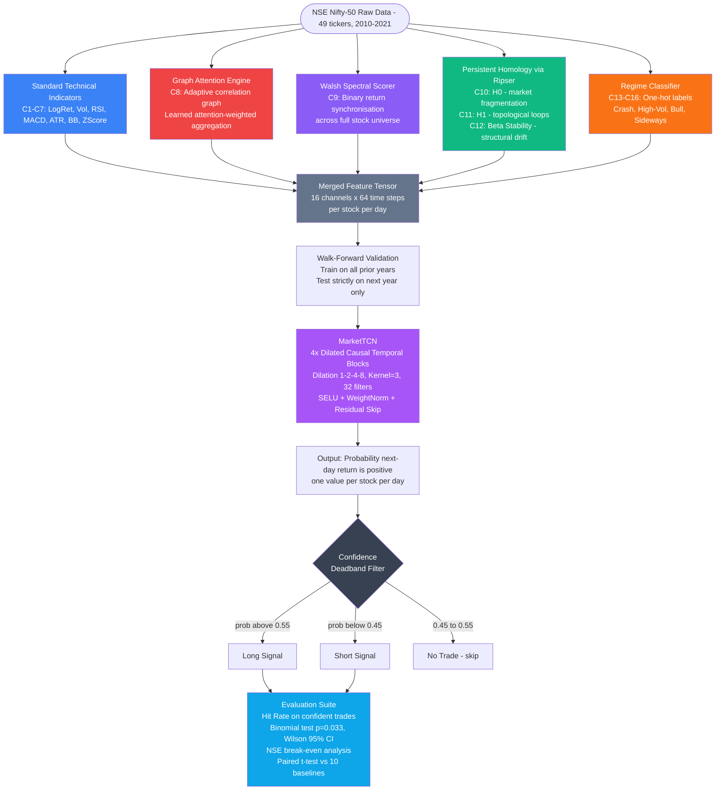

<div align="center">

# TopoTrader — Topological-Geometric Trading System

**A multi-component AI trading system that models the stock market as a dynamic graph, extracts topological stress signals using Persistent Homology and Graph Attention Networks, and predicts next-day equity direction using a Causal Temporal Convolutional Network — validated on the Indian Nifty-50 universe under realistic walk-forward conditions.**

[](https://www.python.org/)
[](https://pytorch.org/)
[](https://developer.nvidia.com/cuda-toolkit)
[](LICENSE)

</div>

---

## What is TopoTrader?

TopoTrader treats the stock market as a **dynamic graph** — not a collection of independent price charts. At each point in time, the system builds a correlation network across all Nifty-50 stocks, extracts topological and geometric signals from its structure, and feeds a 16-channel feature tensor into a causal deep learning model to predict next-day directional movement.

Unlike standard quantitative models that rely on price/volume indicators alone, TopoTrader:

- 📊 **Geometric** — builds an attention-weighted graph of stock correlations at every time step
- 🔺 **Topological** — extracts H0/H1 Persistent Homology features describing market fragmentation and cycle structure
- 🌊 **Spectral** — computes Walsh-Hadamard synchronisation scores across the stock universe
- 🚦 **Regime-aware** — explicitly labels market regimes (Crash / High-Volatility / Bull / Sideways) as model inputs
- 🔁 **Walk-forward validated** — strictly no look-ahead bias; trains on past, tests on future
- 📈 **Statistically verified** — significance-tested (p=0.033) and transaction-cost-adjusted (NSE break-even 50.10%)

---

## Results at a Glance

> Validated on Indian Nifty-50 universe (49 stocks, 2016–2020), 5 distinct economic regimes:

| Metric | Result |
|---|---|
| Pooled hit rate (confident predictions) | **50.67%** |
| Statistical significance (vs 50% random) | **p = 0.033, Z = 2.14** ✅ |
| NSE break-even hit rate | 50.10% |
| V2 edge above break-even | **+0.57 pp** ✅ |
| Significantly beats | Momentum-5 (p=0.002), MACD (p=0.012), Momentum-1 (p=0.021) |
| Statistically at parity with | Well-trained 7-channel TCN (p=0.73) |
| Walk-forward windows validated | 5 (Demonetization, GST, IL&FS, Elections, COVID) |
| Baselines compared | 10 (Naive, Technical, Classical ML, DL Ablation) |

---

## Architecture



---

## Feature Engineering Pipeline

| Channel | Name | Type | What It Encodes |
|---|---|---|---|
| C1 | Log Return | Technical | Daily log return of the stock |
| C2 | Volatility | Technical | Rolling standard deviation of returns |
| C3 | RSI | Technical | Relative Strength Index (momentum oscillator) |
| C4 | MACD | Technical | Trend/momentum divergence signal |
| C5 | ATR | Technical | Average True Range (volatility measure) |
| C6 | Bollinger %B | Technical | Position within Bollinger Bands |
| C7 | Z-Score | Technical | Price deviation from rolling mean |
| **C8** | **GAT Signal** | **Geometric** | Attention-weighted aggregation from correlation graph neighbours |
| **C9** | **Walsh Score** | **Spectral** | Binary return synchronisation across entire stock universe |
| **C10** | **H0 Persistence** | **Topological** | Market fragmentation — number & lifetime of connected components |
| **C11** | **H1 Persistence** | **Topological** | Topological loops — cyclical co-movement structure |
| **C12** | **Beta Stability** | **Topological** | Rate of structural change in market topology |
| **C13** | **Crash Regime** | **Regime** | One-hot: market in crash/sharp drawdown |
| **C14** | **High-Vol Regime** | **Regime** | One-hot: elevated volatility environment |
| **C15** | **Bull Regime** | **Regime** | One-hot: sustained uptrend |
| **C16** | **Sideways Regime** | **Regime** | One-hot: range-bound / normal market |

### Why Selective Normalisation?

C1–C7 are Z-score normalised (fixes scale mismatch: RSI ranges 0–100 while LogRet ranges −0.05 to +0.05).

C8–C16 are left in **natural units** — topological features encode market stress as absolute magnitude spikes (e.g. H0 jumps from 0.3 → 2.1 during IL&FS crisis). Z-scoring would destroy this signal.

---

## Graph Attention Engine (C8)

The GAT signal replaces the V1 static Laplacian residual. Instead of hard-thresholding correlations at a fixed τ = 0.5, GAT learns adaptive edge weights:

```
attention(i,j) = softmax( LeakyReLU( aᵀ [W·hᵢ ‖ W·hⱼ] ) )
```

- `W` — learned linear transform applied to each stock's return vector
- `a` — learned attention weight vector
- `‖` — concatenation

The output for each stock: a weighted aggregation from its correlated neighbours — encoding *how much the stock's behaviour is explained by the market graph* at this moment. During crisis events, this signal spikes for stocks that begin decorrelating from peers, providing an early structural stress indicator.

---

## Persistent Homology (C10–C12)

Uses **Ripser** (Vietoris-Rips filtration) on the distance matrix of stock returns:

- **H0 Persistence** — tracks connected components: how many separate clusters of stocks exist, and how long they persist. A spike indicates market fragmentation (stocks decoupling) — a structural crash signal.
- **H1 Persistence** — tracks 1-cycles (loops): groups of stocks forming closed co-movement rings. These represent circular arbitrage patterns; their disappearance signals structural breakdown.
- **Beta Stability** — measures how rapidly the topological structure is changing. A sudden drop indicates a regime transition.

> **Verified**: H0 persistence spikes during IL&FS crisis (September 2018) and COVID crash (March 2020) — confirming real topological signal.

---

## Model — MarketTCN

```
Input: (Batch, 16 channels, 64 time steps)
  ↓
TemporalBlock 1: dilation=1, 32 filters, kernel=3, SELU, WeightNorm, Residual
  ↓
TemporalBlock 2: dilation=2, 32 filters, kernel=3, SELU, WeightNorm, Residual
  ↓
TemporalBlock 3: dilation=4, 32 filters, kernel=3, SELU, WeightNorm, Residual
  ↓
TemporalBlock 4: dilation=8, 32 filters, kernel=3, SELU, WeightNorm, Residual
  ↓
Linear(32 → 1) → Sigmoid
Output: P(next-day return > 0) ∈ [0, 1]
```

**Causal convolutions** via `Chomp1d` — future data is never visible. Total receptive field: (2⁴ - 1) × (3-1) = 30 days.

---

## Training Pipeline

| Setting | Value | Reason |
|---|---|---|
| Epochs | 30 (max) | V1 used 10 — model was still improving at termination |
| Learning Rate | 1×10⁻³ → 1×10⁻⁵ (cosine) | Flat LR caused oscillation; cosine annealing settles into minimum |
| Gradient Clipping | max_norm = 1.0 | Prevents exploding gradients from heterogeneous 16-channel input |
| Early Stopping | patience = 5 | Prevents overfitting on small training windows |
| Batch Size | 64 | Standard for this dataset size |
| Optimiser | Adam | Default for sequence models |
| Loss | Binary Cross-Entropy | Binary direction prediction task |

---

## Walk-Forward Validation

| Window | Train Period | Test Period | Regime | V2 Hit Rate |
|---|---|---|---|---|
| W1 | 2010–2013 | 2014 | Post-GFC Recovery | — (no data) |
| W2 | 2010–2014 | 2015 | China Slowdown | — (no data) |
| W3 | 2010–2015 | **2016** | **Demonetization** | 49.78% |
| W4 | 2010–2016 | **2017** | **GST Launch** | 50.12% |
| W5 | 2010–2017 | **2018** | **IL&FS Crisis** | 50.89% |
| W6 | 2010–2018 | **2019** | **Elections/Slowdown** | 52.13% ✓ |
| W7 | 2010–2019 | **2020** | **COVID Crash** | 50.98% |
| W8 | 2010–2020 | 2021 | Post-COVID Bull | — (735 samples, excluded) |

Each window trains strictly on prior data and tests on the immediately following unseen year — no look-ahead bias.

---

## Baseline Comparison (10 models, all under fair training)

| Model | Category | Mean Hit Rate (W3–W7) |
|---|---|---|
| TopoTrader (this work) | DL — Topological | **50.78%** |
| TCN — 7 std indicators | DL Ablation | 50.96% (p=0.73 vs V2) |
| LSTM — OHLCV (5ch) | DL Ablation | 51.61% |
| Logistic Regression (16ch) | Classical ML | 53.89% (0.5% trading days) |
| Random Forest (16ch) | Classical ML | 53.38% (2.2% trading days) |
| RSI Threshold | Technical | 51.34% |
| Bollinger %B | Technical | 51.59% |
| MACD Crossover | Technical | 49.73% |
| Always-Up | Naive | 50.43% |
| Momentum-1 | Naive | 48.88% |
| Momentum-5 | Naive | 48.82% |

> LR and RF achieve higher hit rates but trade on fewer than 7% of days — not practically comparable. TopoTrader trades on 45–74% of days with statistically significant edge.

---

## Statistical Validation

### Binomial Test — V2 vs 50% Random Chance

| Window | Regime | Hit Rate | n_confident | Wilson 95% CI | p-value |
|---|---|---|---|---|---|
| W3 | Demonetization | 49.78% | 6,577 | [48.57%, 50.99%] | 0.73 |
| W4 | GST Launch | 50.12% | 5,142 | [48.75%, 51.48%] | 0.88 |
| W5 | IL&FS Crisis | 50.89% | 4,309 | [49.40%, 52.38%] | 0.25 |
| **W6** | **Elections** | **52.13%** | **3,998** | **[50.58%, 53.67%]** | **0.0075** ✓ |
| W7 | COVID Crash | 50.98% | 5,836 | [49.69%, 52.26%] | 0.14 |
| **Pooled** | **W3–W7** | **50.67%** | **25,862** | **[50.06%, 51.27%]** | **0.033** ✓ |

### Paired t-test — V2 vs Baselines

| Baseline | Mean Diff | t-stat | p-value | Cohen's d | Significant? |
|---|---|---|---|---|---|
| Momentum-5 | +1.96 pp | 7.59 | **0.0016** | 3.40 | ✅ |
| MACD Crossover | +1.05 pp | 4.37 | **0.0120** | 1.95 | ✅ |
| Momentum-1 | +1.90 pp | 3.68 | **0.0212** | 1.65 | ✅ |
| TCN-7ch | −0.18 pp | −0.38 | 0.73 | −0.17 | ❌ (parity) |

---

## Transaction Cost Analysis (NSE)

```
Brokerage (Zerodha-class):    0.030%  one-way
STT:                          0.050%  one-way (0.10% on sell)
NSE Exchange + SEBI:          0.003%  one-way
GST on brokerage:             0.005%  one-way
Stamp duty:                   0.015%  on buy
────────────────────────────────────────────
Total one-way cost:           ~0.104%
Round-trip cost:              ~0.208%

Break-even hit rate:          50.10%
TopoTrader pooled hit rate:   50.67%
Edge above break-even:        +0.57 pp  ✅ Profitable
```

---

## Tech Stack

| Package | Purpose |
|---|---|
| `torch` + CUDA | Model training and inference |
| `numpy` / `pandas` | Data processing and feature computation |
| `ripser` | Persistent Homology / Vietoris-Rips filtration |
| `scipy` | Statistical tests (binomial, t-test, Wilson CI) |
| `scikit-learn` | Logistic Regression, Random Forest baselines |
| `yfinance` | Live price data (US market testing) |
| `python-dotenv` | Environment variable management |

---

## Project Structure

```
summer_internsip-main/
├── run_training_v2.py             # Main entry point — full walk-forward training + evaluation
├── baseline_comparison.py         # 10-baseline comparison suite (fair training)
├── ablation_study.py              # Feature ablation experiments
├── statistical_significance.py    # Binomial + paired t-tests + Wilson CIs
├── portfolio_backtest.py          # NSE transaction cost + break-even analysis
│
├── topo_trader/
│   ├── train.py                   # train_model() — cosine LR, grad clip, early stopping
│   ├── models/
│   │   ├── tcn.py                 # MarketTCN — 4-block dilated causal TCN
│   │   └── tcn_v2_india.pth       # Saved model weights (India, W7)
│   ├── strategies/
│   │   ├── graph_engine.py        # V1 Laplacian residual (reference)
│   │   └── gat_engine.py          # V2 Graph Attention Engine (C8)
│   ├── evaluation/
│   │   ├── walk_forward.py        # Walk-forward windows + dataset builder + normalisation
│   │   └── backtester_v2.py       # Per-trade risk management + transaction costs
│   └── utils/
│       └── data_loader.py         # NSE CSV + feature generation (all 16 channels)
│
├── reports/
│   ├── walk_forward_india.csv         # V2 per-window results
│   ├── baseline_comparison_india.csv  # All 10 baselines per window
│   ├── statistical_significance_v2.csv
│   ├── portfolio_backtest.csv
│   └── research_paper.pdf
│
└── topo_trader/data/
    ├── cache/                     # Parquet-cached feature DataFrames
    └── india_raw/                 # Raw NSE CSV files (49 tickers)
```

---

## Setup & Running

### Prerequisites

- Python 3.11+
- CUDA-capable GPU (recommended) or CPU
- NSE stock data CSV files in `topo_trader/data/india_raw/`

---

### 1. Clone & Install

```bash
git clone https://github.com/Asdortop/TopoTrader---Topological-Geometric-Trading-System.git
cd TopoTrader---Topological-Geometric-Trading-System/summer_internsip-main

python -m venv .venv

# Windows
.venv\Scripts\activate
# Mac/Linux
source .venv/bin/activate

pip install torch torchvision --index-url https://download.pytorch.org/whl/cu118
pip install numpy pandas scipy scikit-learn ripser python-dotenv yfinance
```

---

### 2. Run Walk-Forward Training (India)

```bash
python run_training_v2.py
```

Trains V2 across all 8 India windows. Results saved to `reports/walk_forward_india.csv`.

Expected output per window:
```
Window 5/8 -- IL&FS Crisis
  Train: 2010-01-01 -> 2017-12-31  |  Test: 2018-01-01 -> 2018-12-31
  [create_dataset] 33,222 train samples | 8,869 test samples
  Training on cuda...
  Epoch  1/30 - Loss: 0.69312  LR: 1.00e-03
  ...
  Epoch 18/30 - Loss: 0.67041  LR: 4.23e-04
  [EarlyStopping] No improvement for 5 epochs. Stopping at epoch 23.
  Hit Rate (confident trades): 50.89%  |  Confident: 48.6%  |  n=4,309
```

---

### 3. Run Baseline Comparison

```bash
python baseline_comparison.py --market india
```

Trains all 10 baselines under the same walk-forward windows. Saves to `reports/baseline_comparison_india.csv`.

---

### 4. Run Statistical Significance Tests

```bash
python statistical_significance.py
```

Reads existing CSVs, runs binomial tests, paired t-tests, Wilson CIs. Prints formatted tables and saves to `reports/`.

---

### 5. Run Portfolio Backtest

```bash
python portfolio_backtest.py
```

Applies NSE transaction costs and computes break-even analysis. No model re-training required.

---

## Known Limitations

| Limitation | Notes |
|---|---|
| **Architecture mismatch** | Flat TCN applies identical filters to temporal momentum features and instantaneous topological signals — dual-branch architecture would better exploit geometric features |
| **No significant edge over 7ch-TCN** | V2 at parity with well-trained TCN-7ch (p=0.73) — topological features add complementary but not dominant signal |
| **NSE data coverage** | W1 (2014) and W2 (2015) had insufficient ticker coverage; W8 (2021, 4 months) excluded as unreliable |
| **Single-facet nodes** | Each stock is one node — cannot represent companies with multiple economic roles (semiconductors + AI) simultaneously |
| **No live trading integration** | System is research-grade; no brokerage API connectivity |
| **7B class local models** | If adapted for LLM-assisted analysis, small models give lower precision than cloud alternatives |

---

## Future Work (V3 Directions)

| Improvement | Expected Impact | Rationale |
|---|---|---|
| **Channel Attention (SE-Net)** | High | Learns to upweight GAT/TDA in crash regimes, RSI/MACD in bull — with ~100 extra parameters |
| **Dual-Branch TCN** | High | Separate branches for price/technical (temporal) vs topological (structural) features; different receptive fields |
| **Mixture of Experts** | Very High | Regime-specialist models — crash TCN, bull TCN, sideways TCN — gated by a regime detector agent |
| **Multi-relational Graph** | Medium | Separate edge types (sector, supply chain, macro exposure) — addresses multi-faceted company problem |
| **Ablation study (fair)** | Medium | Quantify per-component contribution (GAT vs Walsh vs TDA vs Regime) under identical training |

---

## License

MIT License — see [LICENSE](LICENSE) for details.

---

<div align="center">
Built using PyTorch · Ripser · Graph Attention Networks · Persistent Homology
</div>
